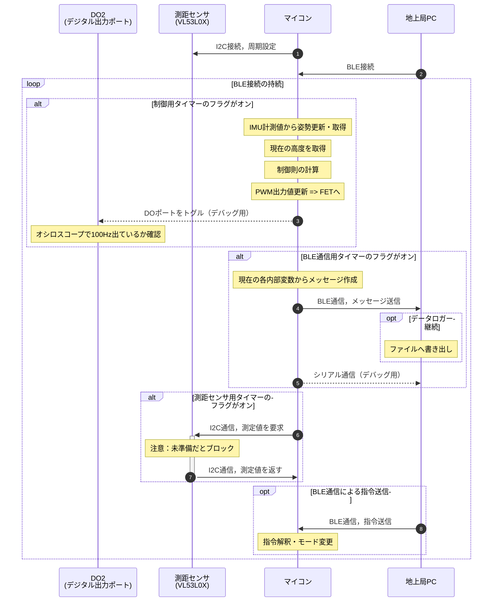
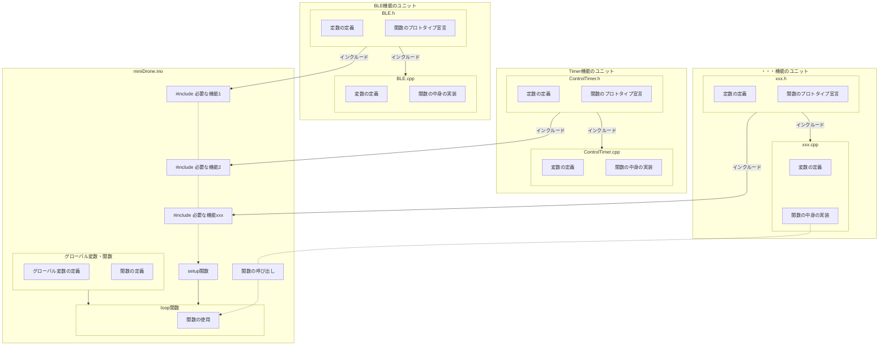
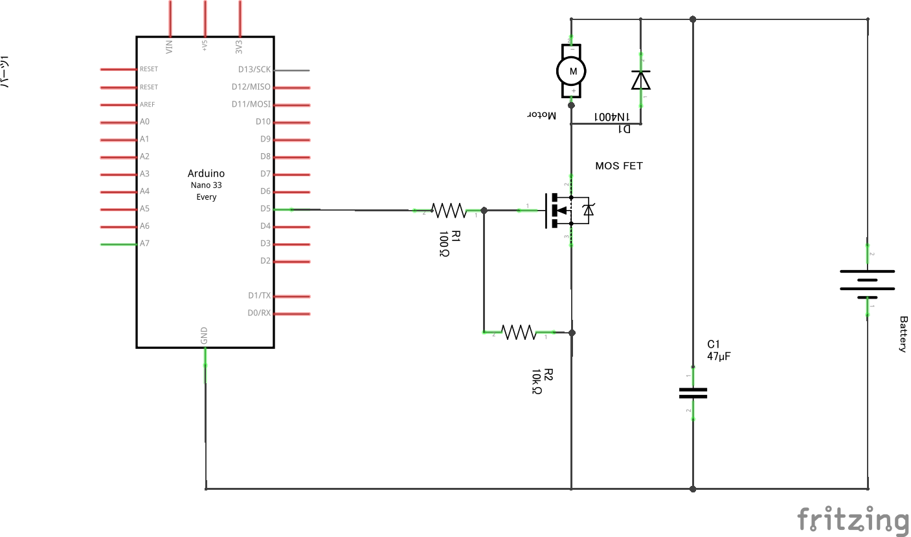

# Mini Drone

## ハードウェア
+ Arduino nano 33 BLE ... BLEモジュールとIMUが搭載されたマイコン（[https://ssci.to/7667](https://ssci.to/7667)）
+ VL53L0X Time-of-Flight 距離センサモジュール ... ToF測距センサ（[https://ssci.to/2894](https://ssci.to/2894)）

### 電気回路の部品
+ FET ... モータ制御用のトランジスタ．
    - 候補1）2SK4019（[https://eleshop.jp/shop/g/gECF311/](https://eleshop.jp/shop/g/gECF311/)）
    - 候補2）2SK4017（[https://akizukidenshi.com/catalog/g/g107597/](https://akizukidenshi.com/catalog/g/g107597/)）
+ 抵抗 ... マイコン電流調整用．100Ω
+ 抵抗 ... プルダウン用．10kΩ
+ ダイオード ... フライバックダイオード．SB240LES（[https://akizukidenshi.com/catalog/g/g116419/](https://akizukidenshi.com/catalog/g/g116419/)）
+ コンデンサ ... パスコン用．セラミックコンデンサー 47μF16V（[https://akizukidenshi.com/catalog/g/g104917/](https://akizukidenshi.com/catalog/g/g104917/)）
+ レギュレータ ... マイコン電源用．3.3V出力ステップアップレギュレータ？（[https://ssci.to/8681](https://ssci.to/8681)）？

## 使用するライブラリ
+ `ArduinoBLE.h` ... BLE(Bluetooth Low Energy)を使用するためのライブラリ．
+ `Arduino_LSM9DS1.h` ... 9軸IMUのライブラリ．
+ `VL53L0X.h` ... ToF(Time of Flight)測距センサのライブラリ．

## 環境構築
1. Arduino IDE をインストール
2. Arduino IDE のボードマネージャから上記ライブラリをインストール  
参考：https://qiita.com/konikoni428/items/f4c7154ccf1eafd331c9

上記に加えて，BLE通信の動作確認のためにターミナルが使えると便利です．たとえばアプリの`LightBlue`など．

## 制御系のブロック線図
制御系のブロック線図の概要を以下に示す．

## シーケンスの概要図
マイコンの制御用コードを100Hzで実行するために，以下のシーケンス構成を考えた．

## コードの構成図
機能ごとにソースコードを分けて，メイン（`miniDrone.ino`）から呼び出して使用する構造にする．
これにより，機能の追加実装やテスト，複数人での開発が容易になることが期待できる．

## 電気回路の構成
モータ1つ分の駆動系の回路を以下に示す．

## トラブルシュート
### デバイスマネージャで COM xx が認識されない
下記を試す．  
+ PCの再起動
+ Arduino IDE のバージョン更新確認
+ Arduino IDE でボード情報の更新
+ マイコンのリセットボタンを押しながら接続

コードが間違っていてマイコン側のUSB Serialが機能しなくなっている可能性がある．その場合は以下を試す．
+ マイコンのリセットボタンをダブルタップ -> 違うCOMポートとして認識 -> 認識したCOMポートで正しいコードを書き込み

## References
### フォルダ構成は下記を参考にした  
+ https://qiita.com/somehiro/items/6a6d954be159b6a5fccd  
+ https://zenn.dev/skou/articles/7a49ca2f9f0fcc

### 駆動系の電気回路は下記を参考にした
+ https://www.remma.net/?p=1341

### COMが認識されなくなる問題のトラブルシュート  
+ https://detail.chiebukuro.yahoo.co.jp/qa/question_detail/q11263532971

### Mermaidの参考ページ
+ https://qiita.com/run1000dori/items/90f91687cfe7ece50020

### VSCodeでDrawioを使って作図する拡張機能について
+ https://otepipi.hatenablog.com/entry/2020/05/25/192844