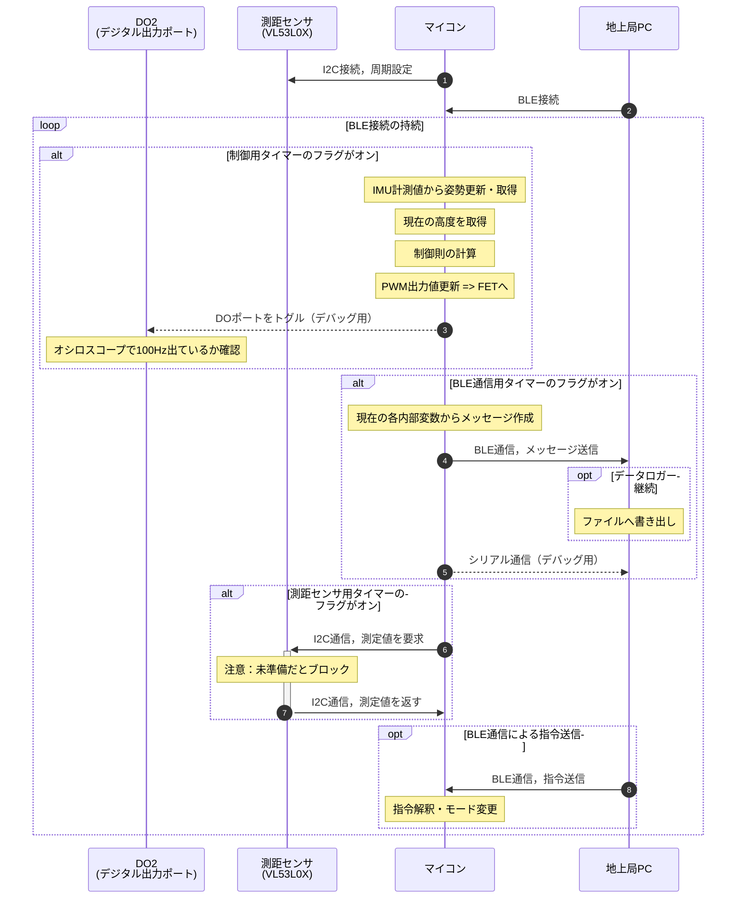
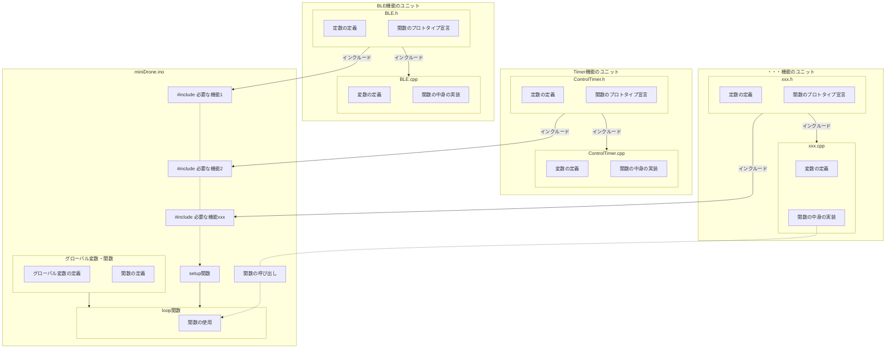
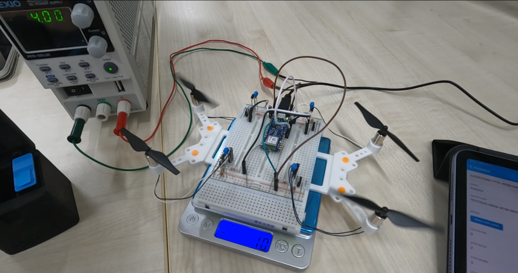
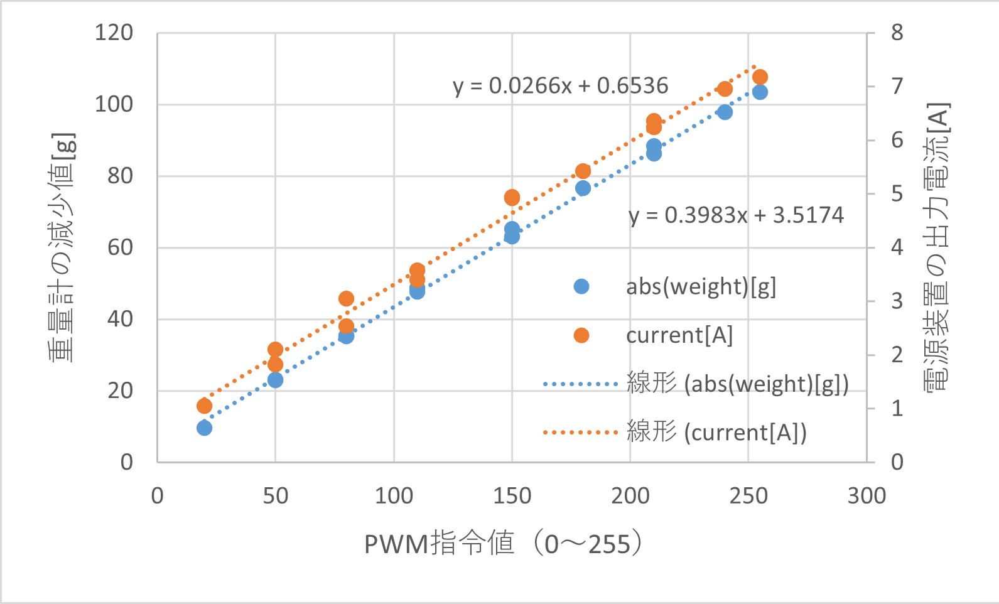
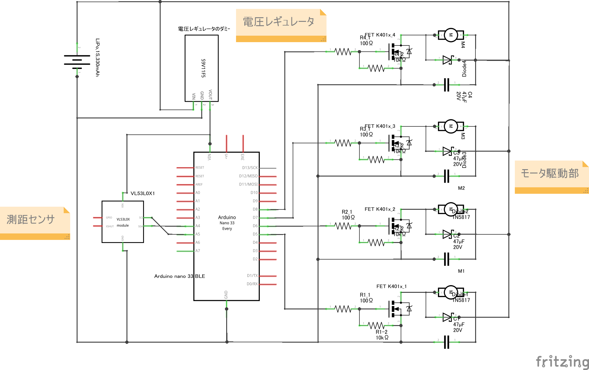

# Mini Drone
100g以下程度の小型ドローン製作を目指すプロジェクトです  

# 目次
1. [概要](#概要)
2. [マイコンのプログラムの基本構成](#マイコンのプログラムの基本構成)
3. [モータ駆動回路の基本構成](#モータ駆動回路の基本構成)
    - [モータの回転方向とプロペラについて](#モータの回転方向とプロペラについて)
    - [PWM出力・推力・電流の予備実験結果](#推力と電流とPWM値の測定実験)
4. [機体の作成](#機体の作成)
    - [概要](#部品の概要)
    - [機体の設計](#機体の設計)
    - [電気回路の構成](#電気回路の構成)
5. [ドローン制御系の基本構成](#ドローン制御系の基本構成)
6. [トラブルシュート](#トラブルシュート)
7. [参考ページ](#references)

# 概要
無線通信が可能なマイコンをフライトコントローラとして用い，地上局（PC）からのおおまかな指令をもとに飛行する小型ドローンを製作します．
特に制御実験に使用することを目指して，以下の要件を設定します．
+ 設定した制御周期を維持できること
+ 内界センサの計測値や計算した制御入力を逐次的に外部に出力できること
+ オリジナルの制御則やフィルタなどを容易に試せること

これらを実現するために，次のようなコードの流れを考えます．
（ここではマイコンとして`Arduino nano 33 BLE`（[https://ssci.to/7667](https://ssci.to/7667)）を使用することを想定していますが，相当の機能を持つマイコンであれば同様に構成可能と思います）

前述のタスクを達成しつつ制御周期を一定に維持するために，3つのタイマーを用いる構成としています．  

まず1つ目は制御則の動作周期をはかるタイマー`tmCon`で，ドローン制御で必要とされている100Hzに設定しています．こちらはデジタル出力ピンにパルス出力をさせてオシロスコープで100Hzが実現できることを確認しました．

2つ目はBLE通信（地上局への送信）のタイミングをはかるタイマー`tmBLE`で，これは`Arduino nano 33 BLE`マイコンで試したところ10Hz程度が安定する最高の速度でしたので10Hz程度で使用しています．（もちろん理想は制御周期と同じ100Hzでの通信ですが...）  

3つ目は機体高度を計測する測距センサから値を読みだす周期をはかるタイマー`tmToF`です．
使用するセンサ（VL53L0Xユニット，I2C接続）の仕様上，計測値の精度を高めるために数十ms必要で，また計測値が準備できていないと読み出し指令がブロックされるとのことなので，少し長めに約33Hz(=30ms)の周期で読み込む時間管理をしています．
（こちらも制御周期と同じ100Hzで読むことが理想なのですが）

またマイコンへの地上局からの指令もBLE通信を使用することにしていますが，こちらは頻繁な通信をしないという前提で，とりあえず時間管理なしで運用しています．今後，地上局も含めた閉ループを高速周期で構成する必要がでてくれば，そのためのタイマーを実装する必要がありそうです．

# マイコンのプログラムの基本構成
フライトコントローラの機能ごとにソースコードを分けて，メイン（`miniDrone.ino`）から呼び出して使用する構造にします．
これにより，機能の追加実装やテスト，複数人での開発が容易になることが期待できます．

最終的にはオリジナルの制御則やフィルタのコードは`Control.cpp`と`Control.h`のようなファイルにまとめるようにして，同じようにメインコードから呼び出して使用するような運用を考えています．
これにより設計者が極力メインコードを触ることなく制御則やフィルタを試せるようにしたいです．

# モータ駆動回路の基本構成
今回は設計を簡単にするために駆動系としてブラシ付きDCモータを使用することにします．
基本となるモータ1つ分の駆動回路を以下に示します．

ここではバッテリーからモータの駆動電流をとることとし，N-ch MOS FETを使って，駆動回路に流れる電流をマイコンのデジタル出力ピンから間接的に操作します．

また図では省略していますが，マイコンの電源はUSBケーブルから供給することを想定しています．
電源が異なるのでグラウンド（`GND`）の共通化を忘れないように注意してください．

この回路に使用している参考部品は以下の通りです．

**表1. モータ駆動回路の構成部品**
| 記号   | 名称        | 用途 | 型番  | 主な選定理由       |
| ----- | ------      | -----| --- | ----------|
| Motor | ブラシ付きDCモータ  | ロータ  | [8520モータ](https://www.amazon.co.jp/s?k=8520%E3%83%A2%E3%83%BC%E3%82%BF%E3%83%BC&crid=C0WW8673TEQ4&sprefix=8520%2Caps%2C163&ref=nb_sb_ss_ts-doa-p_2_4) | 100gクラスのドローン`Tello`の予備部品が流通しているため |
| MOS FET | N-ch 電界効果トランジスタ | 駆動回路のスイッチング | [2SK4017](https://www.google.com/search?client=firefox-b-d&q=2SK4017)など．部品のピン配置は[こちら](https://akizukidenshi.com/goodsaffix/2SK4017.pdf)を参照のこと． | 連続2A以上流せて，オン抵抗が低いFETを選定  |
| D1    | ダイオード   | フライバックダイオード（逆起電力対策） | [SB240LES](https://akizukidenshi.com/catalog/g/g116419/)など    | 駆動電圧より十分高い耐圧で，かつ連続2A以上流せるものを選定 |
| C1    | キャパシタ   | バイパスコンデンサ（パスコン）| [積層セラミックコンデンサー 47μF16V](https://akizukidenshi.com/catalog/g/g104917/)など | 数十μFの容量があること    |
| R1    | 抵抗器    | 電流調整用    | [1/4Wカーボン抵抗100Ω](https://www.marutsu.co.jp/pc/i/107016/)など | - |
| R2    | 抵抗器    | プルダウン抵抗？  | [1/4Wカーボン抵抗10kΩ](https://www.marutsu.co.jp/pc/i/107028/)など | - |
| Battery | 1S LiPoバッテリー  | モータの駆動電源  | [BETAFPV BT2.0 300mAh 1S 30Cバッテリー](https://amzn.asia/d/6Hk7pkt)など | 軽量かつ取扱いが容易で，連続8A以上の放電能力があること |

なお，こちらの回路を使用してモータを駆動させるテストコードは[こちら](https://github.com/kn4ts/MiniDrone/releases/tag/actuator-test)からアクセスできます．
使い方は，BLE通信で接続後，String型で"1"~"9"を送信すると`20`～`255`までのPWM値をD5～D8ピンから出力します（"0"を送ると停止）．モータが回転するので注意してください．

## モータの回転方向とプロペラについて
なおプロペラは`Tello`のスペアパーツとして流通している[こちら](https://amzn.asia/d/75Xps07)やその代替品を使用します．
8520モータの軸に差し込むだけで使用可能です．  
なお8520モータには2種類あり，線の色で見分けられるようです．
線の色と回転方向は以下の表の通りです．

**表2. モータの回転方向**
|モータの線の色|回転方向|
| --- | --- |
|白(-側)と黒(+側)|CW（時計まわり）|
|青(-側)と黒(+側)|CCW（反時計回り）|

そしてこのモータの回転方向に合ったプロペラを取り付けます．
また4つのロータで飛行するクワッドロータドローンでは，対角に同じ回転方向のロータを配置する必要がありますので注意してください．

## 推力と電流とPWM値の測定実験
前述の回路構成をもとに4つのロータを駆動する予備的な実験を行いました．
実験の様子を以下に示します．

ここではモータ駆動用の電源として安定化電源を使用（4.00Vで最大電流値10Aに設定）し，マイコン電源はUSBから供給しました．
またマイコン含む回路部分全体を重量計の上に置き，いくつかのPWM値で4つのロータを同時に駆動した際の重量計の値の減少量とそのときの電源装置の出力電流をメモしました．

その結果を1つの図にプロットしたものを以下に示します．
なお，これらの計測値は定常状態のもの（目視で値が落ち着いたところで読み取ったもの）であるため，結果は参考値です．

この結果から，マイコンに指令するPWM値に対して推力（正確には重量計表示の減少量[g]），電流[A]がいずれもほぼ線形に推移していることが読み取れます．

また推力と電流値を比較することで，機体重量に対する使用バッテリーに要求される放電能力や，飛行可能時間を概算できます．

# 機体の作成
## 部品の概要
+ Arduino nano 33 BLE ... BLEモジュールとIMUが搭載されたマイコン（[https://ssci.to/7667](https://ssci.to/7667)）
+ VL53L0X Time-of-Flight 距離センサモジュール ... ToF測距センサ（[https://ssci.to/2894](https://ssci.to/2894)）
+ 電圧レギュレータ ... マイコン電源用．5V出力ステップアップ／ステップダウン電圧レギュレータ（[https://ssci.to/1168](https://ssci.to/1168)）

## 機体の設計
[電気回路の設計・配置](#電気回路の構成)と合わせて，機体サイズや構造を決定する必要があります．

## 電気回路の構成
以下に駆動系・測距センサ・電圧レギュレータを含めた全体の回路図を示します．

ドローンではマイコン電源もバッテリーからとる必要があるので，電圧レギュレータを挟んで昇降圧したラインをマイコンの`VIN`ピンに接続しています．
また測距センサの駆動電源も，同じくレギュレータからとるようにしています．

こちらの回路図をもとに実体配線図を作成し，基板上に部品を配置してください．
回路や実体配線図の製作については，[fritzing](https://fritzing.org/)や[PasS](http://uaubn.g2.xrea.com/pass/)，Eagleなどを使用すると便利です．

# ドローン制御系の基本構成
制御系の基本構成のブロック線図の概要を以下に示します．

## 使用するライブラリ
+ `ArduinoBLE.h` ... BLE(Bluetooth Low Energy)を使用するためのライブラリ．
+ `Arduino_LSM9DS1.h` ... 9軸IMUのライブラリ．
+ `VL53L0X.h` ... ToF(Time of Flight)測距センサのライブラリ．

## 環境構築
1. Arduino IDE をインストール
2. Arduino IDE のボードマネージャから上記ライブラリをインストール  
参考：https://qiita.com/konikoni428/items/f4c7154ccf1eafd331c9

上記に加えて，BLE通信の動作確認のためにターミナルが使えると便利です．たとえばアプリの`LightBlue`など．

# トラブルシュート
## デバイスマネージャで COM xx が認識されない
下記を試す．  
+ PCの再起動
+ Arduino IDE のバージョン更新確認
+ Arduino IDE でボード情報の更新
+ マイコンのリセットボタンを押しながら接続

コードが間違っていてマイコン側のUSB Serialが機能しなくなっている可能性がある．その場合は以下を試す．
+ マイコンのリセットボタンをダブルタップ -> 違うCOMポートとして認識 -> 認識したCOMポートで正しいコードを書き込み

## References
### フォルダ構成は下記を参考にした  
+ https://qiita.com/somehiro/items/6a6d954be159b6a5fccd  
+ https://zenn.dev/skou/articles/7a49ca2f9f0fcc

### 駆動系の電気回路は下記を参考にした
+ https://www.remma.net/?p=1341

### COMが認識されなくなる問題のトラブルシュート  
+ https://detail.chiebukuro.yahoo.co.jp/qa/question_detail/q11263532971

### Mermaidの参考ページ
+ https://qiita.com/run1000dori/items/90f91687cfe7ece50020

### VSCodeでDrawioを使って作図する拡張機能について
+ https://otepipi.hatenablog.com/entry/2020/05/25/192844