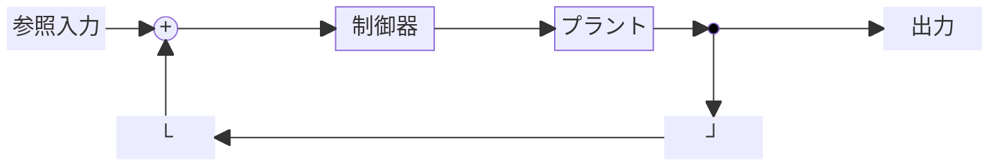
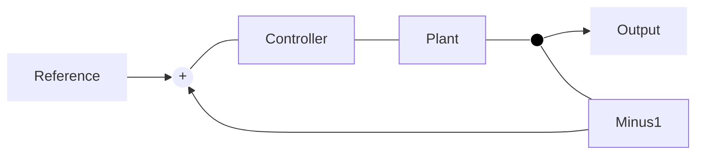

# Mermaid をMarkdownで使うテスト

```mermaid
block-beta

%% 信号用に枠線なしのブロックをクラスとして定義
classDef signal stroke-width:0px
%% 信号分岐用に黒塗りのブロックをクラスとして定義
classDef split fill:black

columns 9
ref["参照入力"] plus(("+")) space cont["制御器"] space plant["プラント"] split1((" ")) space out["出力"]
space:9
space lb["└"] space:4 rb["┘"]

class ref,out,lb,rb signal
class split1 split

ref --> plus
plus --> cont
cont --> plant
plant --> split1
lb --> plus
split1 --> rb
split1 --> out
rb --> lb

```
TEST

```mermaid
flowchart LR
    Reference --> plus1(("+"))
    plus1 --- Controller
    Controller --- Plant
    Plant --- split1((" "))
    split1 --> Output

    %%Output --- Minus1["-1"]

    split1 --- Minus1
    Minus1 --> plus1
    %%<!-- Null2 --> plus1 -->

    classDef signal stroke:none
    classDef split fill:black,stroke:white
    classDef plusminus stroke:white

    class Reference,Output signal
    class split1 split
    class plus1 plusminus
```